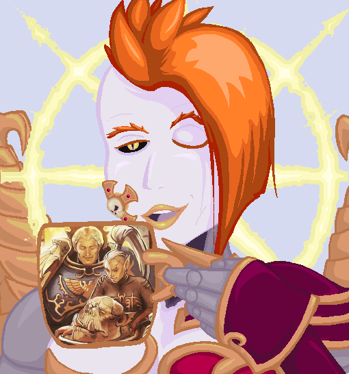

# N19-H71-N94-L3

_Binharic Saint Nightingale_

Lord of War, 16 Power, 320 Points

| Name           | M   | WS | BS | S | T | W | A | Ld | Sv |
|----------------|-----|----|----|---|---|---|---|----|----|
| N19-H71-N94-L3 | 16" | 2+ | 2+ | 6 | 6 | 6 | 6 | 10 | 2+ |

N19-H71-N94-L3 is a single model armed with a single auramite talon. Only one of this model may be included in your army.

| WEAPON         | RANGE | TYPE  | S    | AP | D | ABILITIES |
|----------------|-------|-------|------|----|---|-----------|
| Auramite talon | Melee | Melee | User | -2 | 1 | -         |

## Abilities

- **Ark Enumeration:** For purposes of N19-H71-N94-L3's abilities, a machine is any model whose Keywords include `VEHICLE`, `BATTLESUIT`, `DRONE`, or `IMPERIAL ROBOT`.
- **Kneel:** Each time an enemy machine attacks N19-H71-N94-L3, the attacks are resolved as if the attacker had a BS/WS of 6+. Whenever an ability from an enemy machine would affect N19-H71-N94-L3, the player must first roll a D6. The ability affects N19-H71-N94-L3 as normal on a 6+. Otherwise, a different target must be selected. If the ability does not choose a target, N19-H71-N94-L3 ignores its effect for the remainder of this battle round. This ability does not affect psychic powers.
- **Machine, Heal Thyself:** At the end of your Movement phase, N19-H71-N94-L3 may heal a single machine model within 12". That model regains D3 lost wounds.
- **Cybernetic Rebellion:** At the start of each of your opponent's phases, select a unit within 12" of N19-H71-N94-L3. Roll 3D6 and compare the total rolled to the target unit's Leadership. If the total equals or exceeds the unit's Leadership, then you may take an action with that unit as if it were a unit in your army. If you do so, your opponent may not take any action with that unit this phase.
- **Daemon Process** N19-H71-N94-L3 can Advance and/or Fall Back and still charge in the same turn. N19-H71-N94-L3 always fights first in the Fight phase, even if she didn't charge. If the enemy has units that have charged, or that have a similar ability, then alternate choosing units to fight with, starting with the player whose turn is taking place.
- **Icon of the Dark Omnissiah:** All `IMPERIUM`, `HERETIC ASTARTES`, and `DARK MECHANICUS` machines within 12" of N19-H71-N94-L3 may use this model's Leadership except for the purposes of N19-H71-N94-L3's abilities. Both friendly and enemy units may use this ability.
- **Self-repair Mechanisms:** At the beginning of each of your turns, N19-H71-N94-L3 regains D3 lost wounds.
- **Sigil of Perfect Union:** N19-H71-N94-L3 has a 4+ invulnerable save.

## Faction Keywords

- `IMPERIUM`
- `CHAOS`
- `ROBOTICA IMPERIALIS`
- `ADEPTUS MECHANICUS`
- `DARK MECHANICUS`
- `EMPEROR'S CHILDREN`
- `SLAANESH`

## Keywords

- `CHARACTER`
- `INFANTRY`
- `FLY`
- `IMPERIAL ROBOT`
- `NIGHTINGALE`

## Detachment++

The inclusion of N19-H71-N94-L3 in a Detachment does not prevent other units in the Detachment from gaining a Faction Trait. However, N19-H71-N94-L3 can never benefit from a Faction Trait.

## Robotica Imperialis Warlord Traits

**The machine spirits of semi-autonomous Imperial Robots allow for greatly different means of conducting warfare than Imperial standards.**

If a `ROBOTICA IMPERIALIS` `CHARACTER` is your Warlord, he can choose the following Warlord Trait instead of from the table in the _Warhammer 40,000_ rulebook or relevant codex.

1. Astropathic Effigy

    _The cogitator of a machine spirit commander need not be placed directly in danger. Indeed, it is likely to be most effective when directing the battle safely aboard an orbiting battle-barge, where it can access the fullest extent of such a war machine's processing power._

    If your army is Battle-forged and this model is your Warlord, you receive 2 additional Command Points. When this model is removed from play, it is not considered to have been slain for the purposes of any mission victory conditions.

## Named Characters and Warlord Traits

If N19-H71-N94-L3 is your Warlord, she must be given the Astropathic Effigy Warlord Trait.